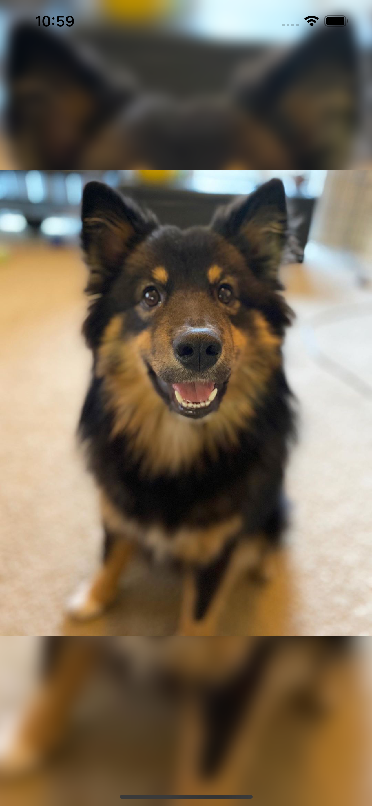
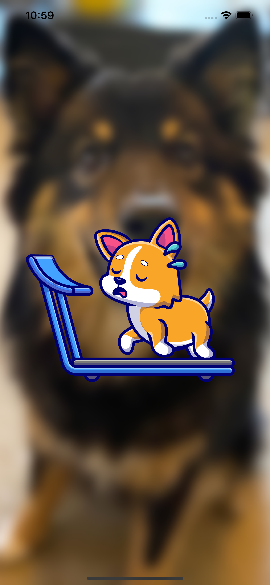
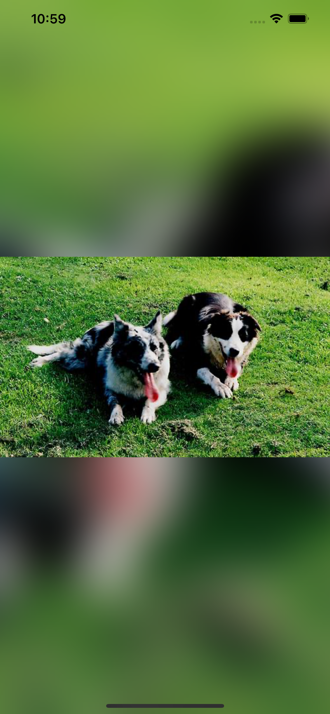

# Shake a Dog

Just shake your app to get a dog image!

I'm using two libraries:

* Lottie for the running dog animation, when loading new image
* SDWebImage to load images

This is a simple project just to learn how to detect the shake gesture, it's really simple, we only need to call motionBegan on our ViewController.